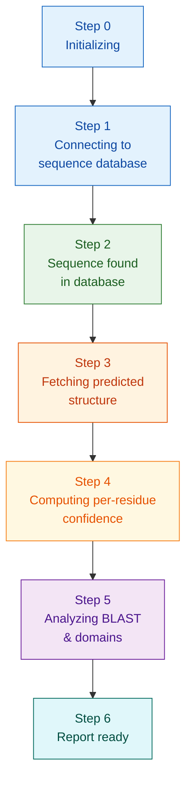
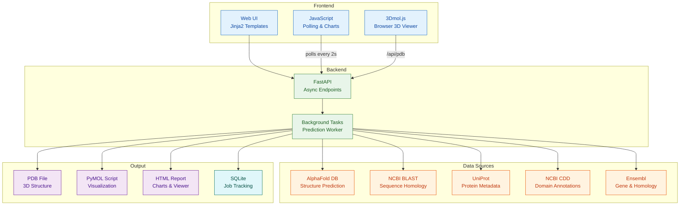

<div align="center">

# Protein Intelligence Platform

**Protein structure prediction, domain analysis, BLAST homology, and browser-based 3D visualization**

[](https://python.org)
[](https://fastapi.tiangolo.com)
[](https://alphafold.ebi.ac.uk)
[](https://3dmol.csb.pitt.edu)
[](https://docker.com)
[](https://render.com)

</div>

---

## Overview

Protein Intelligence Platform is a web service that predicts protein 3D structures using the AlphaFold database, analyzes per-residue confidence scores, runs BLAST sequence homology searches, visualizes protein domains, and renders interactive 3D structure viewers in the browser -- all in one automated pipeline.

```mermaid
graph LR
    A["User Input<br/>UniProt or Sequence"] --> B["AlphaFold DB<br/>Structure Lookup"]
    B --> C["PDB Analysis<br/>pLDDT Confidence"]
    C --> D["BLAST + Domains<br/>Homology &amp; Annotations"]
    D --> E["3D Viewer<br/>3Dmol.js in Browser"]
    E --> F["HTML Report<br/>Charts &amp; Summary"]

    style A fill:#E3F2FD,stroke:#1565C0,color:#0D47A1
    style B fill:#E8F5E9,stroke:#2E7D32,color:#1B5E20
    style C fill:#FFF3E0,stroke:#E65100,color:#BF360C
    style D fill:#F3E5F5,stroke:#6A1B9A,color:#4A148C
    style E fill:#E8F5E9,stroke:#2E7D32,color:#1B5E20
    style F fill:#E0F7FA,stroke:#00695C,color:#004D40
```



---

## Pipeline Flow

The prediction pipeline progresses through **7 stages** with real-time status tracking:



Each step is persisted to SQLite and polled by the frontend every 2 seconds, providing live progress updates.

---

## Architecture



---

## Tech Stack

| Layer            | Technology                                                                 |
| ---------------- | -------------------------------------------------------------------------- |
| **Framework**        | FastAPI (async Python)                                                     |
| **Template**         | Jinja2                                                                     |
| **Database**         | SQLite (zero-config job tracking)                                          |
| **Structure Data**   | AlphaFold DB API (free, no key required)                                   |
| **Bioinformatics**   | Biopython (PDB parsing), Ensembl REST, UniProt API, NCBI E-utilities      |
| **BLAST**            | NCBI BLAST API (sequence homology)                                         |
| **Domain Viz**       | Jinja2 domain track rendering (UniProt + NCBI CDD annotations)             |
| **3D Viewer**        | [3Dmol.js](https://3dmol.csb.pitt.edu) (browser-based, no plugins)        |
| **Visualization**    | PyMOL scripting, Chart.js (confidence charts)                              |
| **Package Manager**  | [uv](https://github.com/astral-sh/uv) (fast Python installs)                |
| **Deployment**       | Docker on Render                                                           |

---

## Quick Start

### Prerequisites

- [Python 3.11+](https://python.org)
- [uv](https://github.com/astral-sh/uv) (recommended) or pip

### Local Development

```bash
# Clone the repository
git clone https://github.com/sanjanb/bio-pipeline.git
cd bio-pipeline

# Install dependencies
uv sync

# Run the development server
uv run uvicorn app:app --reload

# Open http://localhost:8000
```

### Docker

```bash
# Build the image
docker build -t protein-intelligence .

# Run the container
docker run -p 8000:8000 protein-intelligence

# Open http://localhost:8000
```

---

## API Endpoints

| Method   | Path                              | Description                                         |
| -------- | --------------------------------- | --------------------------------------------------- |
| `GET`    | `/`                                 | Prediction input form (UniProt or sequence)         |
| `POST`   | `/predict`                          | Submit UniProt accession or raw sequence for prediction |
| `GET`    | `/status/{job_id}`                  | Real-time pipeline status (auto-refresh)            |
| `GET`    | `/api/status/{job_id}`              | JSON status for polling (`status`, `current_step`)  |
| `GET`    | `/api/pdb/{job_id}`                 | Raw PDB content for 3D viewer                       |
| `GET`    | `/result/{job_id}`                  | Results page with 3D viewer, domains, BLAST, and confidence charts |
| `GET`    | `/view/{job_id}`                    | Standalone HTML report with 3D viewer               |
| `GET`    | `/download/{job_id}/{filename}`     | Download PDB, PyMOL script, or report               |
| `GET`    | `/jobs`                             | Job history listing                                 |

---

## Configuration

| Variable         | Default                                      | Description                     |
| ---------------- | -------------------------------------------- | ------------------------------- |
| `ALPHAFOLD_API`  | `https://alphafold.ebi.ac.uk/api/prediction` | AlphaFold DB endpoint           |
| `OUTPUT_DIR`     | `./output`                                     | Where prediction outputs stored |
| `DB_PATH`        | `./output/jobs.db`                             | SQLite database path            |

---

## Project Structure

```
biotech-pipeline/
├── app.py                  # FastAPI application & routes
├── models/                 # Canonical data models
│   ├── __init__.py         # Package re-exports
│   ├── protein.py          # ProteinProfile, Domain, BlastHit, StructureInfo
│   └── job.py              # Job model & SQLite operations
├── models.py               # Backward-compatible re-export (deprecated)
├── alphafold_client.py     # AlphaFold DB API client
├── pdb_analyzer.py         # PDB parsing & pLDDT analysis
├── pymol_generator.py      # PyMOL visualization scripts
├── report_generator.py     # HTML report generation
├── data_sources/           # Multi-source protein data
│   ├── __init__.py
│   ├── pipeline.py         # Async orchestrator
│   ├── uniprot_client.py   # UniProt API
│   ├── ensembl_client.py   # Ensembl REST API
│   ├── ncbi_client.py      # NCBI E-utilities
│   ├── blast_client.py     # NCBI BLAST API
│   ├── cache.py            # File-based caching
│   └── organism.py         # Organism normalization
├── templates/              # Jinja2 HTML templates
│   ├── index.html          # Input form (UniProt + sequence)
│   ├── status.html         # Pipeline progress
│   ├── result.html         # Results with 3D viewer, domains, BLAST
│   ├── report.html         # Standalone HTML report
│   └── jobs.html           # Job history
├── static/
│   └── style.css           # Application styles
├── tests/                  # Test suite
├── Dockerfile              # Container build
├── render.yaml             # Render deployment
├── pyproject.toml          # Project metadata
└── uv.lock                 # Dependency lockfile
```

---

## Output Files

| File              | Description                                                        |
| ----------------- | ------------------------------------------------------------------ |
| `{job_id}.pdb`    | Predicted 3D protein structure (PDB format)                        |
| `{job_id}.pml`    | PyMOL script -- cartoon + pLDDT confidence coloring                 |
| `{job_id}_report.html` | Interactive HTML report with 3D viewer, domain track, BLAST results, and confidence charts |

### Viewing PyMOL Scripts

```bash
# Open in PyMOL
pymol {job_id}.pml

# Render high-quality image inside PyMOL
ray 1200, 900
png output.png, dpi=300
```

---

## Limitations

- **No authentication** -- open access (suitable for internal/demo use)
- **Background processing** -- predictions run as FastAPI background tasks (no job queue)
- **Local filesystem** -- outputs stored on disk (not S3/cloud)
- **Sequence length** -- max 2700 residues (AlphaFold DB limit)
- **BLAST timeouts** -- BLAST searches are non-blocking and may time out; results are best-effort
- **3D viewer** -- requires a modern browser with JavaScript enabled (Chrome, Firefox, Safari, Edge); no mobile optimization

---

## License

MIT

---

<div align="center">

**Built with [AlphaFold DB](https://alphafold.ebi.ac.uk) | [3Dmol.js](https://3dmol.csb.pitt.edu) | [Biopython](https://biopython.org) | [FastAPI](https://fastapi.tiangolo.com) | [PyMOL](https://pymol.org)**

</div>
